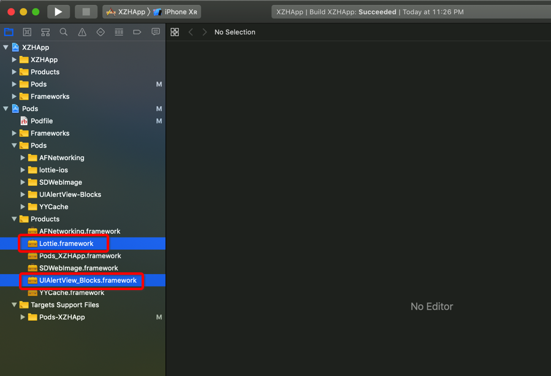

# cocoapods-NameMappedModule

## 经常会出现 podspec name 与 module name 不一样的情况

### [UIAlertView-Blocks](https://github.com/jivadevoe/UIAlertView-Blocks/blob/master/UIAlertView-Blocks.podspec)

```ruby
Pod::Spec.new do |s|
  s.name         =  'UIAlertView-Blocks'
  s.version      =  '1.0'
  s.platform     =  :ios
  s.author       =  'Jiva Devoe'
  s.license      =  { :type => 'MIT', :file => 'LICENSE' }
  s.requires_arc =  true
  s.summary      =  'Category for UIAlertView and UIActionSheet which allows you to use blocks rather than implementing a delegate.'
  s.description  =  'A category for UIAlertView and UIActionSheet which allows you to use blocks to handle the pressed button events rather than implementing a delegate.'
  s.source_files =  '*.{h,m}'
  s.homepage     =  'https://github.com/jivadevoe/UIAlertView-Blocks'
  s.source       =  { :git => 'https://github.com/jivadevoe/UIAlertView-Blocks.git', :tag => '1.0' }
end
```

### [lottie-ios](https://github.com/airbnb/lottie-ios/blob/master/lottie-ios.podspec)

```ruby
Pod::Spec.new do |s|
  s.name             = 'lottie-ios'
  s.version          = '3.1.3'
  s.summary          = 'A library to render native animations from bodymovin json. Now in Swift!'

  s.description = <<-DESC
Lottie is a mobile library for Android and iOS that parses Adobe After Effects animations exported as json with bodymovin and renders the vector animations natively on mobile and through React Native!
For the first time, designers can create and ship beautiful animations without an engineer painstakingly recreating it be hand. Since the animation is backed by JSON they are extremely small in size but can be large in complexity! Animations can be played, resized, looped, sped up, slowed down, and even interactively scrubbed.
  DESC

  s.homepage         = 'https://github.com/airbnb/lottie-ios'
  s.license          = { :type => 'Apache', :file => 'LICENSE' }
  s.author           = { 'Brandon Withrow' => 'buba447@gmail.com' }
  s.source           = { :git => 'https://github.com/airbnb/lottie-ios.git', :tag => s.version.to_s }

  s.swift_version = '5.0'
  s.ios.deployment_target = '9.0'
  s.osx.deployment_target = '10.10'
  s.tvos.deployment_target = '9.0'

  s.source_files = 'lottie-swift/src/**/*'
  s.ios.source_files = 'lottie-swift/iOS/*.swift'
  s.ios.exclude_files = 'lottie-swift/src/Public/MacOS/**/*'
  s.tvos.exclude_files = 'lottie-swift/src/Public/MacOS/**/*'
  s.osx.exclude_files = 'lottie-swift/src/Public/iOS/**/*'

  s.ios.frameworks = ['UIKit', 'CoreGraphics', 'QuartzCore']
  s.tvos.frameworks = ['UIKit', 'CoreGraphics', 'QuartzCore']
  s.osx.frameworks = ['AppKit', 'CoreGraphics', 'QuartzCore']
  s.module_name = 'Lottie'
  s.header_dir = 'Lottie'
end
```

显示使用 `Pod::Spec#module_name = 'Lottie'`

### 最终这2个库构建生成的 framework



映射关系是:

```ruby
pod 'UIAlertView-Blocks' ==> UIAlertView_Blocks.framework
pod 'lottie-ios' ==> Lottie.framework
```

那么就会造成在解析时, 无法得到 pod 与 framework 的映射关系。

### 这个插件作用, 建立这个映射关系, 写入本地文件中

pod install

```
......................


Integrating client project
 ⚠️  podspec name <==> module name
🚗 name_framework_mapping
{"AFNetworking"=>"AFNetworking.framework",
 "SDWebImage"=>"SDWebImage.framework",
 "UIAlertView-Blocks"=>"UIAlertView_Blocks.framework",
 "YYCache"=>"YYCache.framework",
 "lottie-ios"=>"Lottie.framework"}
 🚙 write name_framework_mapping hash to /Users/xiongzenghui/Desktop/XZHApp/.name_framework_mapping.json
Sending stats

......................
```

写入的本地文件

```json
{
  "AFNetworking": "AFNetworking.framework",
  "SDWebImage": "SDWebImage.framework",
  "UIAlertView-Blocks": "UIAlertView_Blocks.framework",
  "YYCache": "YYCache.framework",
  "lottie-ios": "Lottie.framework"
}
```


## Installation

    $ gem install cocoapods-NameMappedModule

## Usage

    $ pod spec NameMappedModule POD_NAME
